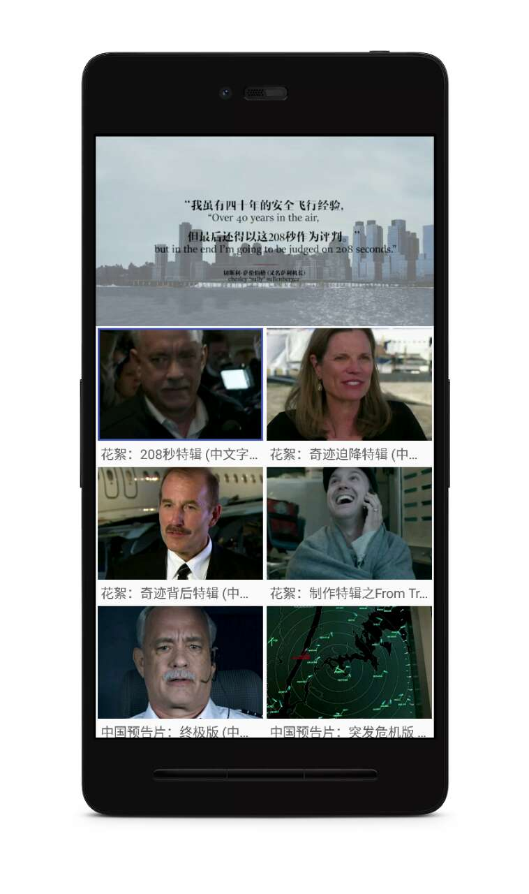

# BigBoom
RxJava &amp; Retrofit &amp; MVP

这是一个根据[豆瓣电影API](https://developers.douban.com/wiki/?title=movie_v2)所做的电影资讯的App

**版权说明：该项目纯属练手项目，不作为商用项目！有涉及到侵权请告知删除，涉及商用侵权与本人无关！**

## 下载地址
[下载地址](http://fir.im/bigboom)

## 更新日志

V1.0
* 基本功能实现(浏览，搜索，下载图片，夜间模式)

## 相关技术记录
- [x] Retrofit的封装
- [x] Glide的封装
- [x] MVP的初步构建
- [x] 全局的沉浸式 [Android 「透明栏」 Or 「沉浸式顶栏」](http://www.jianshu.com/p/e1c937000343)
- [x] 轮播图的实现 [RxJava 实现ViewPager的轮播图](http://www.jianshu.com/p/cc88ab20f991)
- [x] [RecyclerView悬浮条](http://www.jianshu.com/p/fe69a53502ab)
- [ ] ScrollView可以固定某一个子View
- [x] Activity跳转动画兼容5.0以下[TransitionHelper](https://github.com/ImmortalZ/TransitionHelper)
- [ ] 夜间模式

## 开源技术
1. [Rxjava](https://github.com/ReactiveX/RxJava)
2. [RxAndroid](https://github.com/ReactiveX/RxAndroid)
3. [Retrofit](https://github.com/square/retrofit)
4. [Glide](https://github.com/bumptech/glide)
5. [Butter Knife](https://github.com/JakeWharton/butterknife)
6. [greenDAO](https://github.com/greenrobot/greenDAO)
7. [ParticleView](https://github.com/JeasonWong/Particle)
8. [okhttp3](https://github.com/square/okhttp)
9. [DanmakuFlameMaster](https://github.com/Bilibili/DanmakuFlameMaster)
10. [vitamio2](https://www.vitamio.org/)
11. [leakcanary](https://github.com/square/leakcanary)

## 效果图

